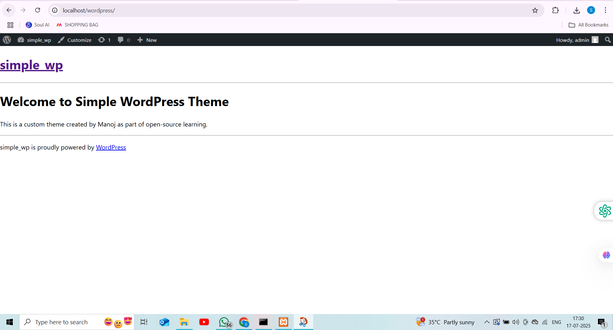

# 🎨 Simple WordPress Theme

A lightweight, custom-built WordPress theme built from scratch to demonstrate WordPress theme development fundamentals and Git version control.

> 💡 Built as part of an open-source learning journey and WordPress contribution initiative (e.g. RT Camp Campus Program).

---

## 🌟 Features

- Minimalist and clean layout
- Built with core WordPress theme structure (no frameworks)
- Fully responsive and fast
- Organized file structure
- Easy to extend or customize

---

## 📸 Screenshot



---

## 🚀 Getting Started

### 📁 Installation (Local WordPress)

1. Clone or download this repo:

```bash
git clone https://github.com/manoj987654/simple-wordpress-theme.git
```

2. Move the folder to your WordPress `themes` directory:

```bash
wp-content/themes/simple-wordpress-theme
```

3. Log into your WordPress admin dashboard → `Appearance` → `Themes`
4. Activate the **Simple WordPress Theme**
5. Visit your home page to see it in action!

---

## 🛠️ Folder Structure

```
simple-wordpress-theme/
│
├── index.php          # Theme structure
├── style.css          # WordPress theme header & styles
├── functions.php      # Theme setup and functions
├── screenshot.png     # Preview for WordPress dashboard
└── README.md
```

---

## 👨‍💻 Author

**Manoj Silla**  
📫 GitHub: [manoj987654](https://github.com/manoj987654)

---

## 📄 License

This theme is open-sourced under the [GNU General Public License v2.0](https://www.gnu.org/licenses/old-licenses/gpl-2.0.en.html).

---

## 🤝 Contribute

Pull requests are welcome! Feel free to fork the repository and submit improvements or features.

---

## 📌 Note for Recruiters / RT Camp

This project showcases my understanding of:

- WordPress theme structure & PHP
- Open-source contribution etiquette
- Git version control & GitHub usage
- Ability to learn and apply real-world tools

Let me know if you'd like a deployed version!